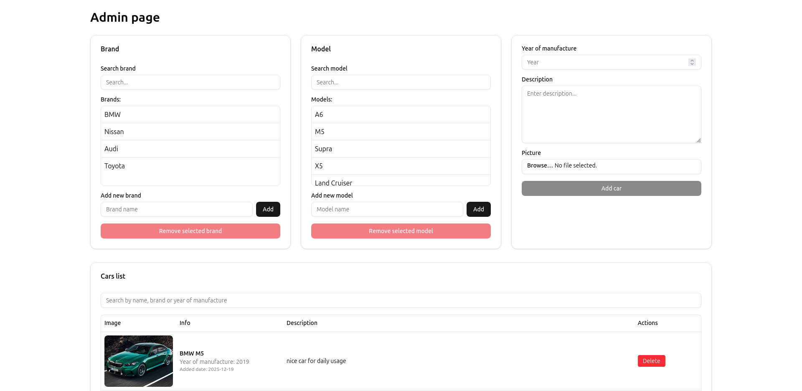
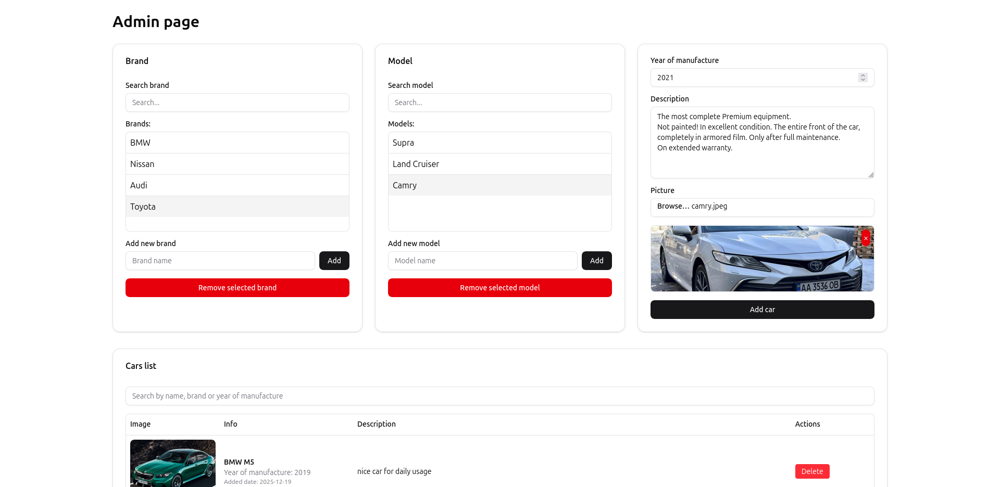
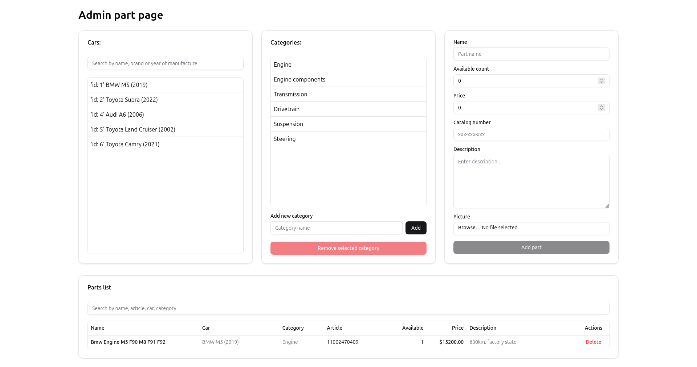

# Parts Store

Auto parts store built with Spring Boot and React.

### About project

- Parts Store is a full-stack web application designed for finding auto parts for car repair and customization.
- The project was developed for my brother’s small local business, which required a simple and effective online platform to present and sell products.

- The main objective is to provide a convenient solution for local sales of specialized products from a single store.

## 🛠 Tech Stack

### Backend
- Java 21
- Spring Boot
- PostgreSQL
- Docker

### Frontend
- React
- Vite
- Tailwind CSS
- Shadcn/ui

## 🚀 How to run

_Will be added soon_

## 📸 Screenshots

### Admin page

## 📝 Future tasks

- Make main parts page
- Add spring sequrity for administration